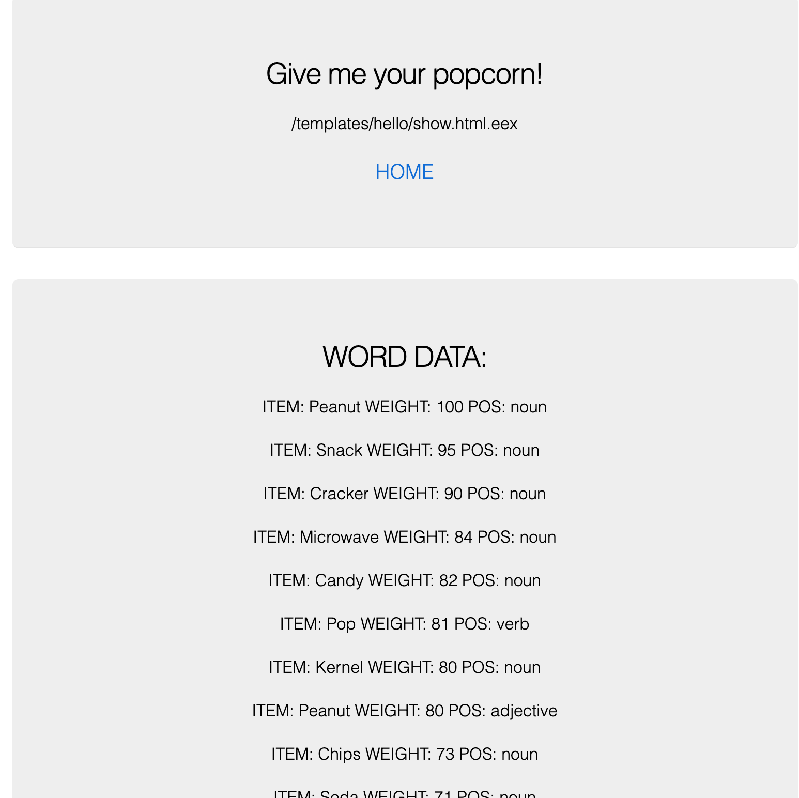

# Word Associations api wrapper
Most of this came from [Phoenix up and running guide](https://hexdocs.pm/phoenix/up_and_running.html)

Wraps [Word Associations API](https://wordassociations.net/en/api)

Start up:

  * Install dependencies with `mix deps.get`
  * Create and migrate your database with `mix ecto.setup`
  * Install Node.js dependencies with `cd assets && npm install`
  * Start Phoenix endpoint with `mix phx.server`

Now you can visit [`localhost:4000`](http://localhost:4000) from your browser.

I documented all issues I had while setting up in the [NOTES.md](../NOTES.md) file.

## USAGE
### ! Before this will work, you need an api key from [Word Associations API](https://wordassociations.net/en/api) site. Place it in the [config file](config/config.exs) on line 17.

Find word associations with any word with path below:

[`localhost:4000/hello/{word}`](http://localhost:4000/hello/{word})

Example with `/hello/popcorn`:

## PHOENIX LINKS

  * Official website: http://www.phoenixframework.org/
  * Guides: https://hexdocs.pm/phoenix/overview.html
  * Docs: https://hexdocs.pm/phoenix
  * Mailing list: http://groups.google.com/group/phoenix-talk
  * Source: https://github.com/phoenixframework/phoenix
